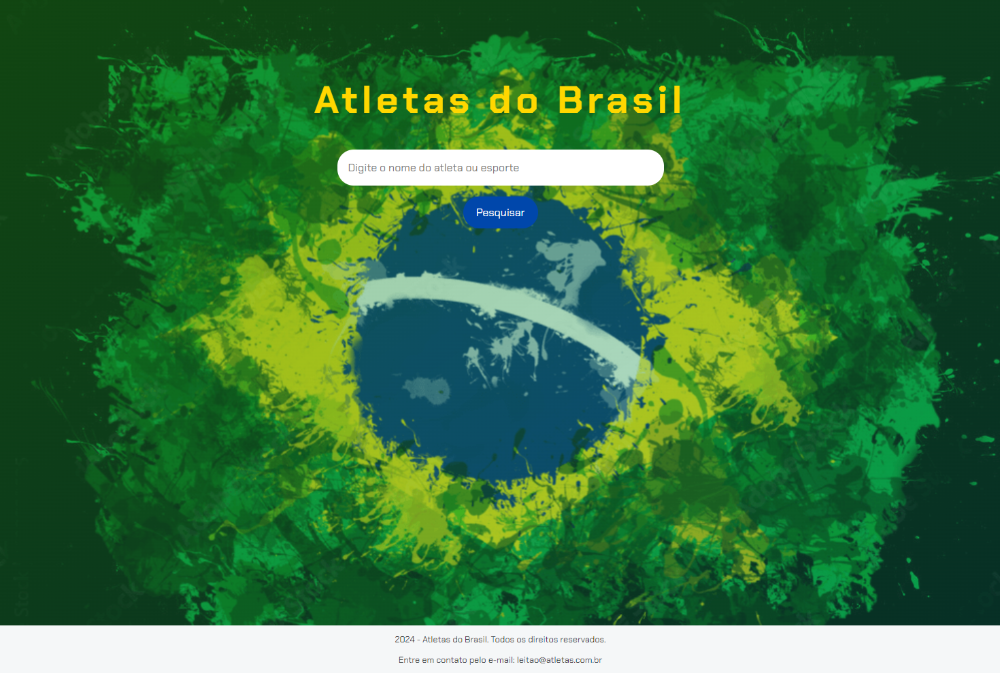
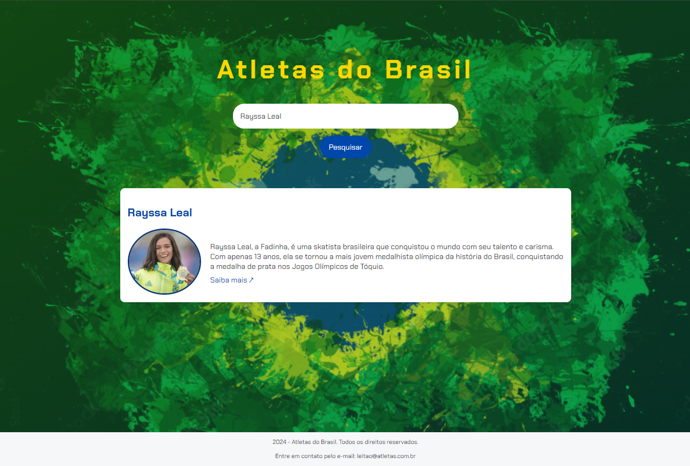

# Alura | Imersão Dev com Google Gemini

## Atletas do Brasil | A maior base de atletas brasileiros

<!-- fonte para readme stats: https://github.com/anuraghazra/github-readme-stats -->
<!-- fonte para badges e shieds: https://github.com/iuricode/readme-template/tree/main -->

## 📄 Sobre
Pequeno sistema de pesquisa feito durante as 5 aulas da [Imersão Dev Alura com Google Gemini](https://cursos.alura.com.br/imersao) em Setembro/2024, com o objetivo de estudar e práticar os conhecimentos de HTML, CSS e JavaScript

📸 Screenshot

  
  

- 🌐 [Versão em produção](https://atletas-do-brasil-rust.vercel.app/)
- 🐙 [Repositório](https://github.com/seralterego/atletas-do-brasil)

## 🛠 Funcionalidades

Sistema de pesquisa simples, com uma base de dados sendo preenchida ainda, sobre atletas de destaque do cenário brasileiro.

## 🎓 Aprendizados

Aprendi nesse projeto:
- A organizar funções JavaScript;
- A utilizar corretamente o `for` dentro de uma função.
- Evolui na utilização de animações com CSS utilizando `transtion` e `transform`.

## 🧰 Tecnologias e Recursos Utilizados

- [Google Gemini](https://gemini.google.com/) para suporte e consultas de dúvidas durante a evolução do projeto
- [Google Fonts](https://fonts.google.com/specimen/Chakra+Petch) Chakra Petch

## 🔜 Pro Futuro
- [ ] Refatorar código JavaScript
- [ ] Corrigir bug de erro na pesquisa

## 🤝 Quem fez?

Oi, meu nome é Sérgio Leitão, você pode me achar em qualquer uma das redes abaixo pra bater um papo:

  
  
  

 

Aqui é o meu perfil profissonal, podemos bater um papo mais sério:

  

 

Ou você pode me mandar uma mensagem por aqui...

  

 

<!-- Ahhh, se puder, dá uma passada no meu site...lá além de outros projetos tão legais quanto esse (a internet é uma mina de ouro...só procurar bem!), estou sempre atualizando com o que acho de mais legal e interessante sobre tecnologia e outras <i>cositas mas</i>...acessa ai:  
🖥 <a href="https://sergioleitao.com.br">sergioleitao.com.br</a> -->

## 🎯 Status

Projeto finalizado conforme os ensinamento da Imersão, MAS, estou com ideias para implementações que irei fazer durante os próximos dias, como:
- [ ] filtro por modalidades
- [ ] um formulário para inclusão de novos atletas
- [ ] vinculo com IA para coleta de informações atualizadas

## © Licença

- [MIT](https://choosealicense.com/licenses/mit/)